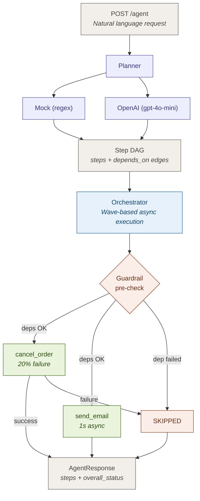

# Mini Agent Orchestrator

A lightweight, event-driven order processing agent that receives natural language
requests, decomposes them into an executable plan, and runs async tools with
dependency-aware orchestration.

## Problem

Given: "Cancel my order 9921 and email me the confirmation at user@example.com."
The system should:

Parse the NL input into structured steps -Planner
Execute mock tools asynchronously -Tool Executor/Tools
Respect dependencies between steps -Orchestrator
Handle failures gracefully i.e don't send email if cancellation failed-Failure Handlinganmd Guardrails

## Overall Design Sketch



## Mock tools

Mock tools (cancel_order, send_email) will simulate success/failure based on input (e.g., order ID 9921 cancels successfully, but 9922 fails).

## Planner and The plan

- What does the user want - Planner that can parse the NL input and create  a structured plan.
- A plan is a DAG of steps but how to represent it?
  - Each step will implicitly have:
    - what tool to call
    - with what args
    - what must finish first
  - Datamodel and Dataclasses to represent the plan and steps should suffice.

## How Do I Run the plan?

- Orchestrator that can take the plan and execute it respecting dependencies.
- Naive: run steps in order, one by one, waiting for each to finish before starting the next.
- Better: topological sort, then run each "wave" concurrently.

## Guardrails - What if something fails?.

- Failure is not just about retrying. It's about propagation as well.
- We need check dependency status before running a step. If any dependency failed, we should skip the step and mark it as SKIPPED in the final response.

## API Endpoint-How do I expose this? (API)

- Single endpoint. Stateless request/response.
- The plan + execution results are the response. No need for job queues,
  polling, webhooks for now.
- Return the full trace (every step's status, result, error) so the caller
  can debug without asking the server.


## Quick Start

```bash
pip install -r requirements.txt

uvicorn app:app --reload

# For with OpenAI
export OPENAI_API_KEY=sk-
uvicorn app:app --reload
```

### Error Handling Strategy

| Scenario                                  | Behavior                                                                     |
| ----------------------------------------- | ---------------------------------------------------------------------------- |
| `cancel_order` fails (20% chance)         | Step marked `FAILED`. Downstream `send_email` is `SKIPPED` with explanation. |
| Unknown tool in plan                      | Step marked `FAILED` with "Unknown tool" error. Dependents skipped.          |
| LLM returns unparseable JSON              | HTTP 400 returned before execution starts.                                   |
| LLM API timeout / 5xx                     | HTTP 502 with error detail.                                                  |
| Request has no recognizable intent (mock) | HTTP 400: "could not parse request".                                         |
|                                           |                                                                              |

The core guardrail: **failed steps poison their dependents**. This prevents false workflows like sending a "cancellation confirmed" email when the cancellation actually failed.

## Why These Choices

- **FastAPI + async**: Natural fit for I/O-bound tool calls. `asyncio.gather` for concurrent execution.
- **Dataclasses for Steps, Pydantic for API**: Dataclasses are lighter for internal state; Pydantic handles serialization/validation at the API boundary.
- **No database**: For a stateless request-response agent, in-memory plan state is sufficient. A production version would persist plans to a store for auditability.
- **Registry pattern for tools**: Decouples tool definition from orchestration. New tools don't touch orchestrator code.

### Note 

Single-module by design for a assignment of this scope. Production would split into planner.py, tools.py, orchestrator.py, api.py.
